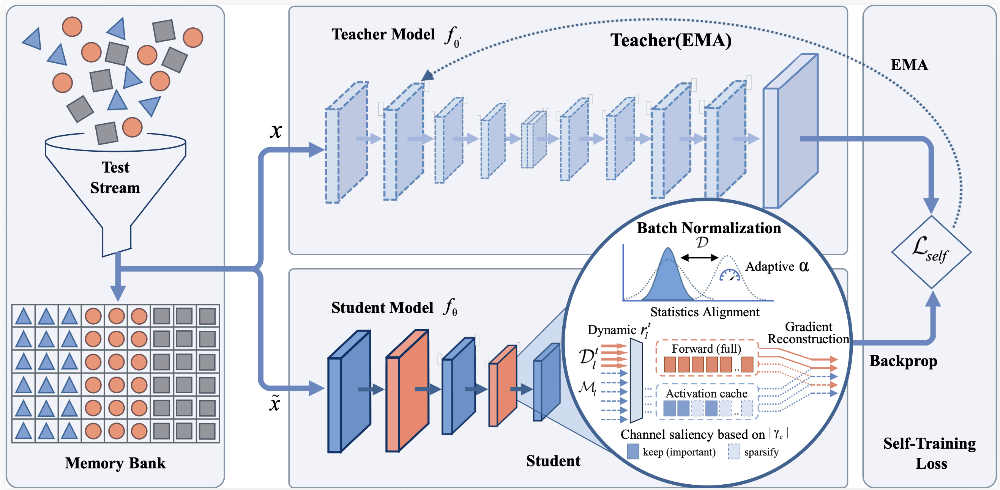

# On-Device Realistic Test-Time Adaptation via Bias-Resistant Statistical Alignment

This repository provides the official implementation of **BOSA** for our IJCAI 2026 paper **On-Device Realistic Test-Time Adaptation via Bias-Resistant Statistical Alignment**.
BOSA is designed for realistic on-device test-time adaptation, where test data arrive as non-stationary streams and can be affected by class imbalance and distribution shifts. The method performs bias-resistant statistical alignment to adapt models online without requiring access to source-domain data.

<p align="center">
  
</p>

## Installation

Create a Python environment and install the required packages:

```bash
conda create -n bosa python=3.9
conda activate bosa
pip install -r requirements.txt
```

## Data and Checkpoints

Please download the required datasets and checkpoints manually. Then set `_C.DATA_DIR` and `_C.CKPT_DIR` in `core/configs/defaults.py` to the corresponding local paths.

## Quick Start

Run BOSA on CIFAR-100-C with the realistic protocol:

```bash
python main.py -acfg configs/adapter/bosa.yaml -dcfg configs/dataset/cifar100.yaml -pcfg configs/protocol/gli_tta.yaml OUTPUT_DIR bosa/cifar100
```

Logs and evaluation results will be saved to:

```text
bosa/cifar100/log.txt
```

## Acknowledgements
This project is based on the following open-source projects:

- [TRIBE](https://github.com/Gorilla-Lab-SCUT/TRIBE.git)
- [RoTTA](https://github.com/BIT-DA/RoTTA.git)

We thank the authors for making the source code publicly available.

## Citation

The citation entry will be updated once the paper is publicly available.
